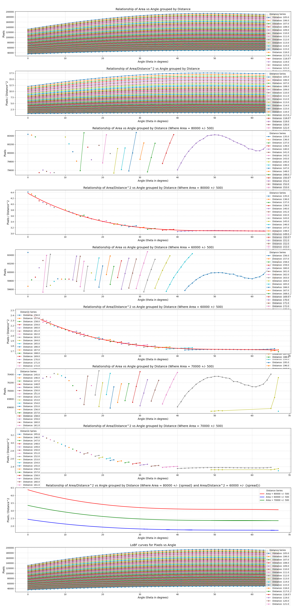
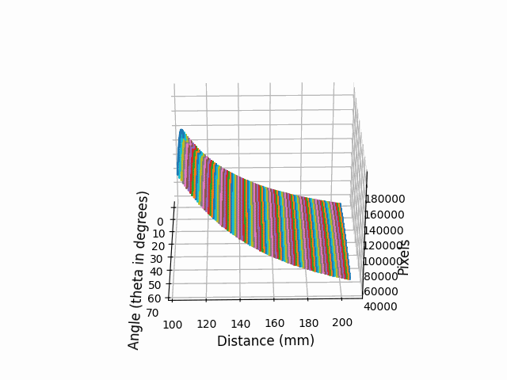
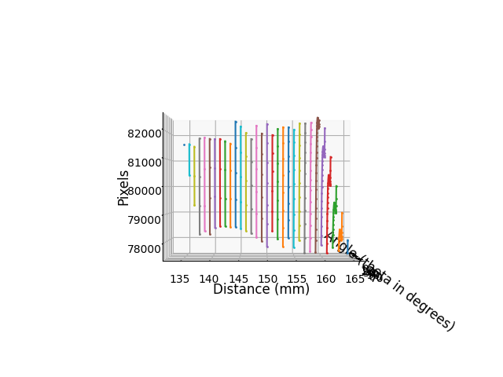
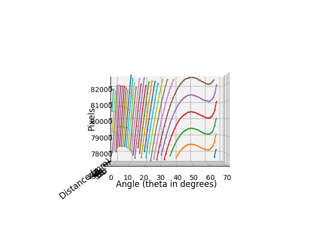
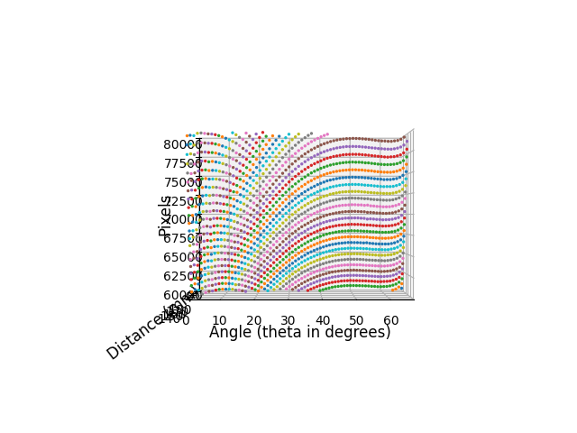
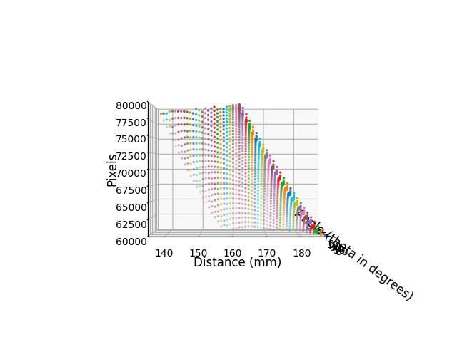
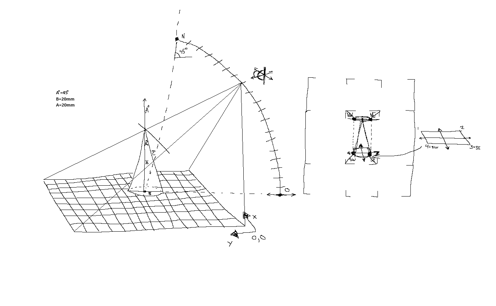
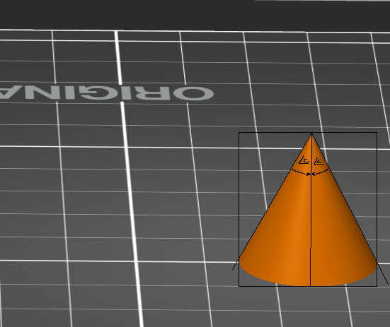
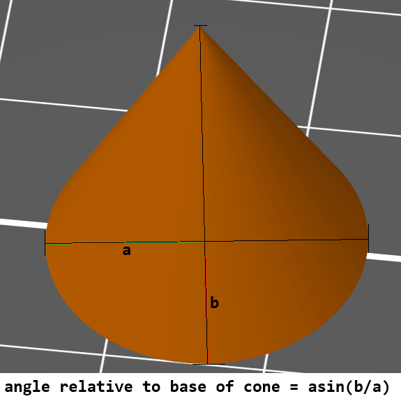

# Tracking Cones


> A possibly misguided attempt at a camera positioning system using 3D printing, Blender, and Python.


# Cones

In short, cones are pretty great for tracking. Right circular cones, specifically.

This work seems very novel, but I haven't seen it used anywhere else.

The key insights from this experiment are:

1. The base of a cone is easy to localize and is always located at the left and right most contours.

Ability to:

- Calculate distance to camera using pixel distance between left and right most contours.
- Calculate z angle of the camera relative to the base of a cone using the ratio of the major and minor axes of the ellipse fit to the base of the cone.
- Calculate the rotational angle of the camera relative to the base of a cone using the angle of the major axis of the ellipse fit to the base of the cone.

2. The tip of a cone is easy to localize and is always located at the top most contour.

- Provides a second value to calculate rotational pose of the camera relative to the cone/assumed shared plane in scene.

---

I learned that the cross-sectional area of the cone is proportional to the angle of the camera relative to the base of the cone. As the angle increases, the cross-sectional area decreases until 45 degrees. Cross-sectional area shrinks with angle increase as seen in the following charts.









My research suggests that PnP would be a more robust solution for this problem, but I've continued this research out of curiosity.


## Interresting observations



Showcases how pixel counts constrains distance. A pixel count of 70k ranges immediately constrains the distance to between 145mm to 175mm. It also 




As distance increases, the pixel count ranges are less constrained.


The dataset was expanded to cover distances 105mm to 1005mm, 900 distances, 67 angles, creating 61K+ data points of pixel counts.

## Setup

Install Docker

```bash
docker compose up -d
```

Exec into tracking_server container and run the renderer:
```bash
docker exec -it tracking_server bash
blender --background --script renderer.py
```

Perform contour and ellipse fitting:
```bash
docker exec -it tracking_server bash
python3 eclipse.py 
```

Convert the renders to a GIF:
```bash
docker exec -it tracking_server bash
python3 renders-to-gif.py
```

## Idea sketches




