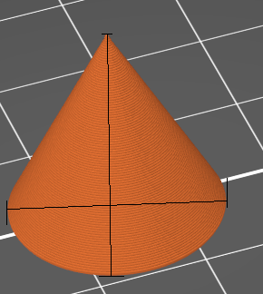
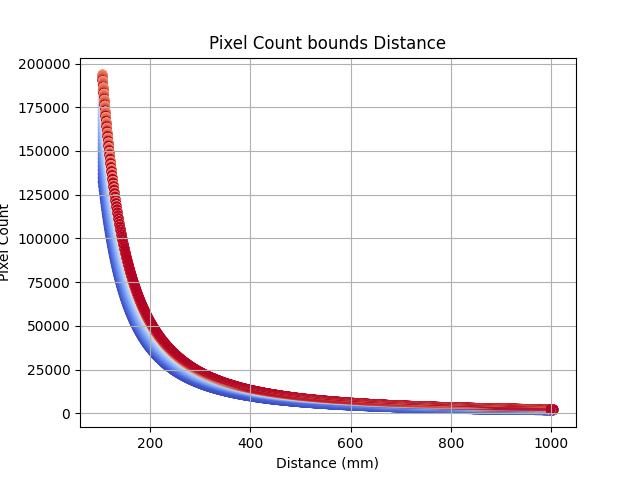
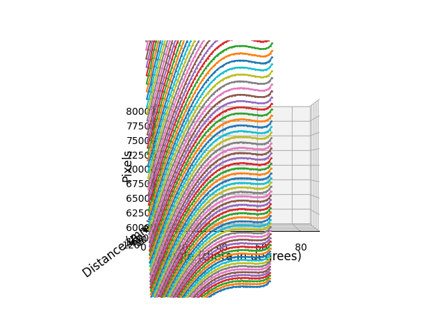
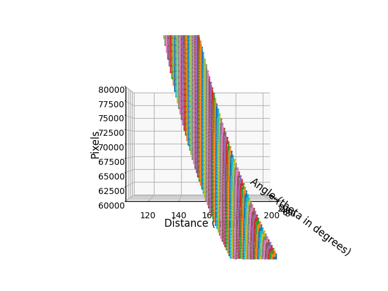
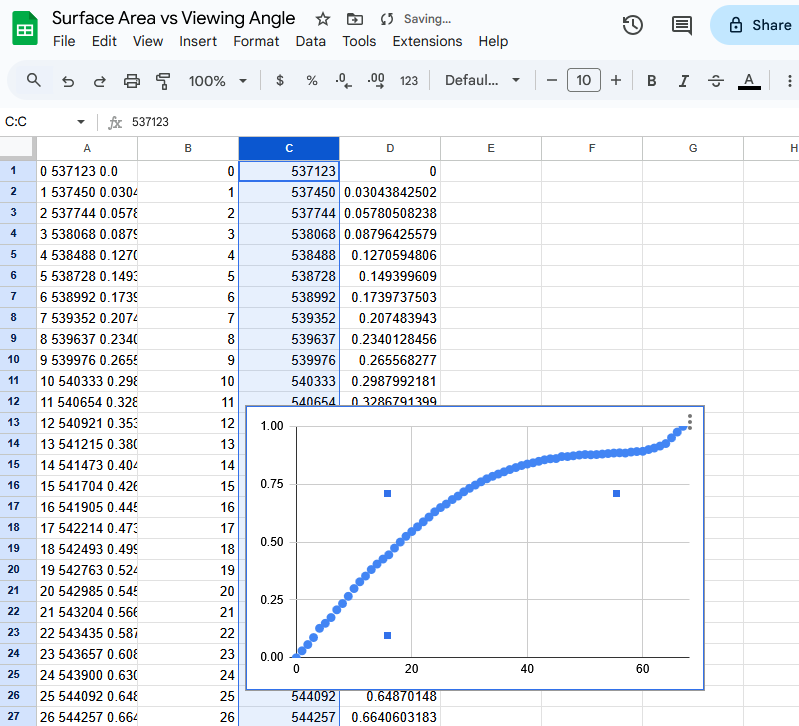
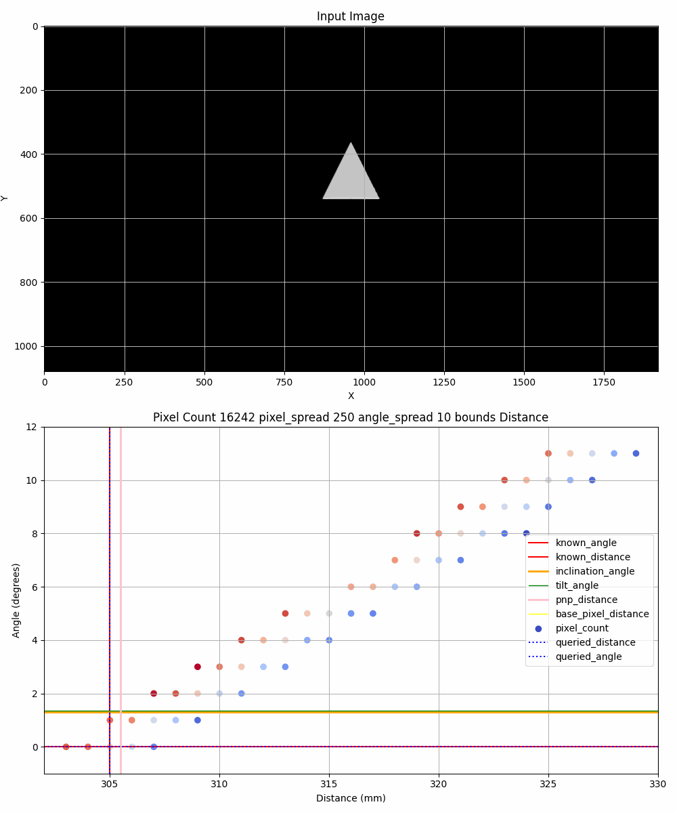
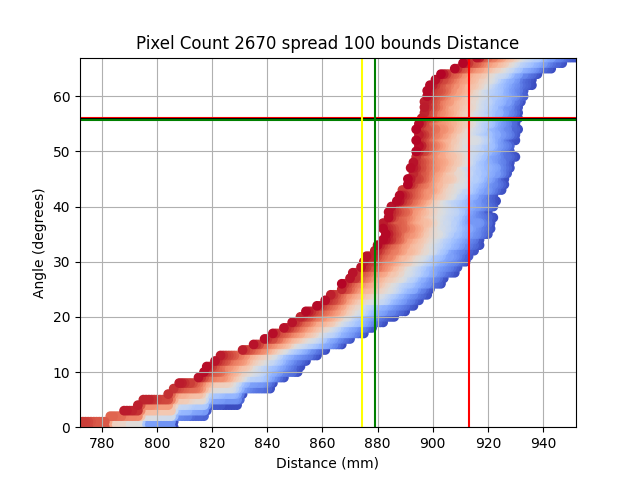
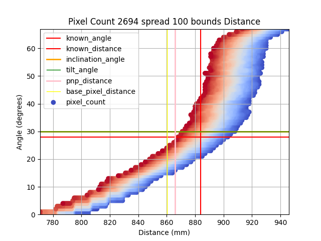
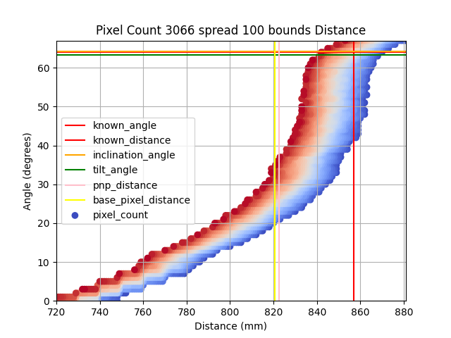

# Tracking Cones


> A possibly misguided attempt at a camera positioning system using 3D printing, Blender, and Python.

# TOC

- [0. Foreword](#0-foreword)
- [I. Introduction](#i-introduction)
  - [Background](#background)
  - [Problem Statement](#problem-statement)
  - [Proposed Solution](#proposed-solution)
  - [Objectives](#objectives)
- [II. Literature Review](#ii-literature-review)
  - [Vision Based Navigation](#vision-based-navigation)
  - [Geometric Primitive Localization](#geometric-primitive-localization)
  - [PnP](#pnp)
- [III. Theoretical Framework & Mathematical Modeling](#iii-theoretical-framework--mathematical-modeling)
  - [Conic Geometry in 3D Space](#conic-geometry-in-3d-space)
  - [The Camera Model](#the-camera-model)
  - [Cone Feature Extraction](#cone-feature-extraction)
  - [Pixel Count Analysis](#pixel-count-analysis)
  - [Angle Estimation](#angle-estimation)
  - [PNP Calculation](#pnp-calculation)
- [IV. Implementation](#iv-implementation)
  - [Pixel Count Dataset](#pixel-count-dataset)
  - [Pixel Count Query Approach](#pixel-count-query-approach)
  - [Working Theory](#working-theory)
- [V. Results](#v-results)
  - [Dataset](#dataset)
  - [STL](#stl)
  - [Figures](#figures)
  - [Performance Analysis](#performance-analysis)
- [VI. Future Work](#vi-future-work)
- [VII. Setup](#vii-setup)
- [VIII. Ideas and stale visualizations](#viii-ideas-and-stale-visualizations)

# 0. Foreword

Cones are pretty neat.


This novel approach explores using pixel count and the estimated angle of inclination to estimate the distance and orientation of a camera relative to a cone of known dimension.

Why?
- It's very easy to localize a cone and 4 key points in a scene.
- A cone's pixel count is a function of distance and angle of inclination.
- Short distances constrain the distance decision space.

#### This approach is unreasonably simple, performant, and effective.

This implementation cheats slightly. It focuses on best case segmentation. In reality, this approach is very sensitive to segmentation error. It's possible there exists advanced methods for segmenting a cone from a scene with extreme precision, but this is not the focus of this project.

# I. Introduction

## Background

The necessity of autonomous navigation in GPS-denied environments (deep space, lunar proximity).
Photogrammetry.
Problem of camera localization and environment mapping.

## Problem Statement

The challenge of estimating a 6-DOF camera pose using limited visual cues.

## Proposed Solution

Utilizing a single known conical object as a navigational beacon by analyzing its projected pixel area and the observed angle of its apex/sides.

## Objectives

To derive a mathematical model for distance and orientation estimation based on conical projection.

# II. Literature Review

## Vision Based Navigation

Current state of star trackers and horizon sensors.
AprilTags.

## Geometric Primitive Localization

Previous work on using spheres or cylinders for pose estimation.

## PnP

Previous work on using PnP for pose estimation.
Mathematical foundations of projecting quadratic surfaces onto a 2D image plane.

# III. Theoretical Framework & Mathematical Modeling

## Conic Geometry in 3D Space

Defining the cone by its height (h), base radius (r), and semi-vertical angle (α).

| Height | Radius | Base | Height | Slant Height |
| --- | --- | --- | --- | --- |
| 20mm | 10mm | 20mm | 20mm | 28.28mm |

## The Camera Model

Establishing the intrinsic matrix (K) and the transformation from world coordinates to the image plane.

Photos are to be synethically generated using Blender.

Focal length: 50mm
Sensor size: 36mm x 20mm
Image size: 1920px x 1080px

### Camera matrix K:

```
K = [[fx, 0, cx], [0, fy, cy], [0, 0, 1]]
```

```
fx = 50mm * (1920px / 36mm) = 2666.67px
cx = 1920px / 2 = 960px
fy = 50mm * (1080px / 20mm) = 2700px
cy = 1080px / 2 = 540px
```

```
K = [
    [2666.67, 0, 960],
    [0, 2700, 540],
    [0, 0, 1]
]
```

Distance coefficient [1, 1, 1, 1]

## Cone Feature Extraction

- The cone's apex is the top most contour.
- The left most contour and right most contour define the base width of the cone.
- The center is midpoint between left and right of the base.
- The front is the bottom most contour.
- The back is the point on the line between front and center, at a distance of r from the center.

## Pixel Count Analysis

Pixels within the cone contour are counted.

O(n) complexity.

## Angle Estimation

Using the front, left, right, and center points, we can calculate the major and minor axes of the ellipse fit to the base of the cone.

Taking the inverse sin of minor over major provides the inclination angle.

This angle can also be described as the camera's z-axis tilt relative to the cone’s base.

## PNP Calculation

2D points are extracted from the contours.

(x, y)
- top: lowest y value, center x value of the highest y value contours
- left: lowest x value, center y value of the lowest x value contours
- right: highest x value, center y value of the highest x value contours
- center: midpoint between left and right
- front: lowest y value, center x value of the lowest y value contours
- back: slope between front and center is calculated and used to calculate the back point

3D values are provided for each of the 6 2D points

(x, y, z)
- Top (0, 0, 20)
- Left (-10, 0, 0)
- Right (10, 0, 0)
- Front (0, 10, 0)
- Back (0, -10, 0)
- Center (0, 0, 0)

And then combined to use the cv2 provided solvePnP method using the SOLVEPNP_ITERATIVE solver.

The results are used to calculate the distance and the angle of inclination of the camera relative to the cone.

# IV. Implementation

## Pixel Count Dataset

A 20mm by 20mm right circular cone was created using OnShape and exported as an .stl file.

The cone was imported into Blender and rendered with a transparent background at distances of 105mm to 1005mm (1mm increments), 900 distances, 68 angles (0 to 67 degree increments), with focus on the base centerpoint, and created 61K+ data points of pixel counts.

## Pixel Count Query Approach

Angle of inclination is calculated:
- using the major and minor axes of the ellipse fit to the base of the cone
- using the angle of inclination calculated using PNP

The two values are averaged and used as the query input angle.

The query input angle and the pixel count are used to query the dataset for the expected distance.

## Working Theory

Angle of inclination of a cone can be calculated much more accurately than the distance alone. Use the angle of inclination to map and constrain the decision space of the query.

A local space is queried and a distance is calculated based on the angle delta and the pixel count. This distance equation is applied to the local space and the value with the lowest distance is selected as the answer. The idea is to allow for a sort of fuzzy matching to allow some noise in the pixel count and angle delta.

#### Input example:

```
Query input angle: 35 degrees
Pixel count: 1000
Pixel spread: 250px
Angle spread: 10 degrees
```

Using the input angle, pixel count, pixel spread, and angle spread, the dataset is queried for the expected distance.

#### Output covering 105mm to 999mm (1mm increments) at 35 degrees (static):


Here we see the input and a subset of the decision space considered for the query.

# V. Results

## Dataset

61269 1080p .png frames totaling 27.4 GB (26.4GB gzip level 9).

Second order CSV created from traversing of the datapoints of the dataset:
https://drive.google.com/file/d/14JnkB5_gfXsh9JslPNT_ygp9nTcKPcPc/view?usp=sharing

Second order spreadsheet created from traversing of the datapoints of the dataset:
https://docs.google.com/spreadsheets/d/1jAnREQOFrAC9bc6-9hUv07EDbun0gzWJSUG7m3Bfx1k/edit?usp=sharing

## STL

https://www.printables.com/model/1599008-tracking-cone

## Figures

FOV Shift Examples




Dataset visualization


2D dataset visualizations




Subsection dataset visualizations


## Performance Analysis

#### IRL Video Results

<video src="docs/irl-video-results.mp4"></video>

#### Compared to pixel estimation and PNP, queried pixel count is more accurate 93% of the time.

- A lot of this accounts to low degree angles of inclination being difficult to localize.

#### The average distance and angle delta: 1.352mm, 0.484deg.

- Across the entire dataset, the queried distance and angle were extremely accurate 

#### Delta analysies


# VI. Future Work

#### Improvements to angle of inclination accuracy at low angles

#### Performance analysis of impact of low angle inclination accuracy

#### Improvements to pixel count accuracy

# VII. Setup

Install Docker

```bash
docker compose up -d
```

Exec into tracking_server container and run the renderer:
```bash
docker exec -it tracking_server bash
blender --background --script renderer.py
```

Perform contour and ellipse fitting:
```bash
docker exec -it tracking_server bash
python3 eclipse.py 
```

Convert the renders to a GIF:
```bash
docker exec -it tracking_server bash
python3 renders-to-gif.py
```

# VIII. Ideas and stale visualizations















